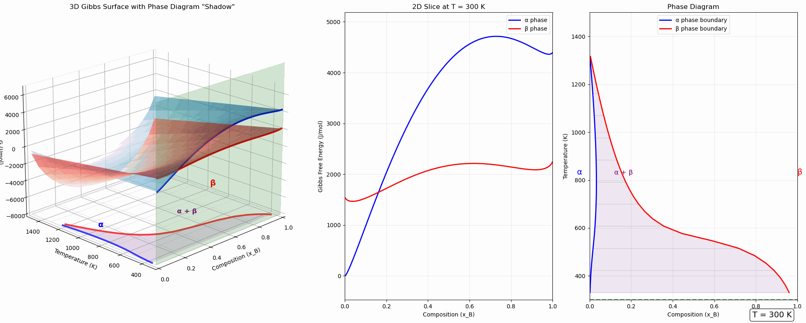

# 🔬 Gibbs Phase Diagram Visualization

<div align="center">

### **Phase Diagrams: From Shadows to Surfaces**

An interactive 3D visualization that reveals the geometric connection between Gibbs free energy surfaces and phase diagrams.

[](https://dimascad.github.io/gibbs-phase-diagram/)
[](https://www.python.org/)
[](https://marimo.io)
[](LICENSE)



</div>

---

## 🎯 What Is This?

Phase diagrams are the **roadmaps of materials science**, but the connection from Gibbs free energy equations to these diagrams can be opaque. This interactive visualization reveals the geometry that connects them.

**The key insight:** Phase diagrams are 2D projections ("shadows") of 3D thermodynamic surfaces.

### The Three-Panel View

1. **3D Gibbs Surface** (left) - The complete thermodynamic landscape showing how Gibbs free energy varies with both composition and temperature
2. **2D Gibbs Slice** (middle) - A cross-section at your selected temperature, showing the common tangent construction
3. **Phase Diagram** (right) - The resulting phase boundaries, with your current temperature highlighted

## ✨ Features

- **Interactive Temperature Control** - Use the slider to explore how phases change from 300K to 1500K
- **Real-Time Updates** - All three visualizations update instantly using marimo's reactive notebook architecture
- **Common Tangent Construction** - Watch how equilibrium phase compositions are determined geometrically
- **3D Surface Projection** - See the "shadow" of the phase diagram on the bottom plane of the 3D plot
- **Educational Context** - Built-in explanations of the thermodynamic principles and mathematical foundations

## 🚀 Quick Start

### Try It Online

**[Launch the live interactive demo →](https://dimascad.github.io/gibbs-phase-diagram/)**

No installation required! The visualization runs directly in your browser.

### Run Locally

1. **Install marimo:**
   ```bash
   pip install marimo
   ```

2. **Clone this repository:**
   ```bash
   git clone https://github.com/dimascad/gibbs-phase-diagram.git
   cd gibbs-phase-diagram
   ```

3. **Launch the notebook:**
   ```bash
   marimo edit gibbs_phase_diagram.py
   ```

The interactive notebook will open in your browser at `http://localhost:2718`

## 📚 The Science Behind It

The visualization uses the **regular solution model** to calculate Gibbs free energy:

```
G = G_reference + G_mixing + G_excess
```

Where:
- **G_reference** = x·G°_B + (1-x)·G°_A (temperature-dependent baseline)
- **G_mixing** = RT[x ln(x) + (1-x) ln(1-x)] (ideal entropy of mixing)
- **G_excess** = x(1-x)·ω (non-ideal interaction energy)

At each temperature, the code solves for equilibrium by finding where:
- Chemical potentials are equal: ∂G_α/∂x = ∂G_β/∂x
- A common tangent connects both Gibbs curves

This is the same fundamental process used by professional CALPHAD software like Thermo-Calc and PANDAT!

## 🎓 Educational Context

**Course:** Phase Transformations in Metals & Alloys - Autumn 2025
**Instructor:** Professor Yunzhi Wang
**Author:** Anthony DiMascio

This visualization was created to help students understand:
- How 2D phase diagrams emerge from 3D thermodynamic surfaces
- The geometric meaning of the common tangent construction
- Why phases separate at low temperatures and mix at high temperatures
- The role of entropy vs. enthalpy in phase equilibria

## 🔬 What You Can Learn

### Temperature Effects

- **Low temperatures (300-600K):** Strong phase separation due to high interaction energy
- **Medium temperatures (700-1000K):** Moderate miscibility gap
- **High temperatures (>1100K):** Increased mixing as entropy dominates

### Key Observations

- Watch how the 3D surfaces "flatten" at high temperatures - this is entropy smoothing out energy differences
- See how tie-lines in the two-phase region connect equilibrium compositions
- Notice that the phase boundary "shadow" perfectly matches the calculated phase diagram

## 🛠️ Technical Details

**Built with:**
- [marimo](https://marimo.io) - Reactive Python notebooks
- NumPy & SciPy - Numerical computations
- Matplotlib - 3D visualization and plotting

**Key algorithms:**
- Regular solution thermodynamic model
- Numerical root-finding for common tangent construction
- 3D surface mesh generation and projection

## 📖 References

**Foundational Reading:**
- Gaskell, D.R. (2017). *Introduction to the Thermodynamics of Materials* - Chapter 9: Binary Phase Diagrams
- Porter, D.A. & Easterling, K.E. (2021). *Phase Transformations in Metals and Alloys* - Chapter 1: Thermodynamics and Phase Diagrams

**Computational Methods:**
- CALPHAD (CALculation of PHAse Diagrams) methodology
- Software: Thermo-Calc, PANDAT, FactSage, PyCalphad, OpenCalphad

## 🤝 Contributing

Suggestions and improvements are welcome! Feel free to:
- Open an issue for bugs or feature requests
- Submit a pull request with enhancements
- Share how you're using this in education or research

## 📬 Contact

**Anthony DiMascio**

For questions, suggestions, or collaboration opportunities, please open an issue on this repository.

---

<div align="center">

**[⭐ Star this repo](https://github.com/dimascad/gibbs-phase-diagram)** if you find it useful!

Made with ❤️ using [marimo](https://marimo.io)

</div>
